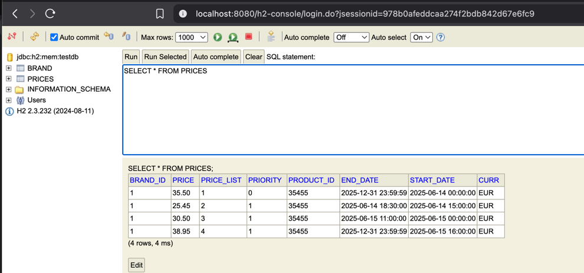

# product pricing api Project

This project is a pricing service developed for the Zara store, using **Spring Boot 3.4+** and **Java 21**. It is based on a hexagonal architecture and is organized into three main modules: **Application**, **Domain**, and **Infrastructure**. The service provides a REST API that allows querying Zara product prices based on parameters such as the application date, product ID, and brand ID.

## Architecture

The hexagonal architecture has been chosen to promote separation of concerns and facilitate code maintainability and scalability. The modules are organized as follows:

1. **Application**: Contains the application logic and use cases. It handles interactions with the domain and serves as the entry point for service operations.

2. **Domain**: Defines domain objects and business rules. It is independent of infrastructure and application, ensuring flexibility and maintainability.

3. **Infrastructure**: Manages interactions with external systems, such as databases, APIs, and network services. It implements the interfaces defined in the application module and provides concrete solutions for persistence and other technical functionalities.


## Dependencies

The project uses several key dependencies to enhance its functionality and facilitate development:

- **Lombok**: Eases code writing by reducing the amount of boilerplate code needed, such as getters, setters, and constructors.

- **MapStruct**: Provides a simple way to map between objects, which is useful for converting between domain entities and DTOs (Data Transfer Objects).

- **Spring Data JPA**: Facilitates interaction with databases through the implementation of repositories and entity management.

- **Spring Boot Actuator**: Provides monitoring and metrics functionalities, allowing for the supervision of the application's state and the exposure of metrics through endpoints.

- **SonarQube**: Used for code quality analysis and test coverage, helping to maintain quality standards in development.

- **Logstash Logback**: A Logback appender that formats and sends application logs in JSON format directly to Logstash over TCP, enabling centralized log collection and structured log analysis within the ELK stack.


## API First

This project follows an **API First** approach, meaning that the API definition is created before the implementation of the code. This approach allows development teams and stakeholders to collaborate on the API specification, ensuring that everyone is aligned on the requirements and expected behavior.

The API specification can be found in the file:

- **[`product-pricing-api.yaml`](./infrastructure/src/main/resources/open-api/product-pricing-api.yaml)**: This file contains the API definition, including endpoints, parameters, and expected responses.


## How to Run the Project

### 1. Clone the Repository

```bash
git clone https://github.com/lion-m-d/product-pricing-api.git
cd product-pricing-api
```

### 2. Build the Project

Run a clean build of the project:

```bash
mvn clean install
```

### 3. Build Docker Images

Build all necessary images without using cache:

```bash
docker-compose build --no-cache
```

### 4. Start the Environment with Docker

Start the necessary internal services (InfluxDB, Grafana, PostgreSQL, Prometheus and SonarQube):

```bash
docker-compose up -d influxdb prometheus grafana  postgres sonarqube elasticsearch logstash kibana
```

**Note**: The price service uses H2 as an in-memory database, while PostgreSQL is used exclusively for SonarQube.

### 5. Run Coverage Analysis with SonarQube

Access SonarQube at: [http://localhost:9000](http://localhost:9000)

User: `admin`

Password: `admin` or `admin1` (depending on the initial configuration)

Request a password change if necessary and then run the analysis:

```bash
mvn verify sonar:sonar \
  -Dsonar.projectKey=product-pricing-api \
  -Dsonar.host.url=http://localhost:9000 \
  -Dsonar.login=admin \
  -Dsonar.password=admin1
```


### 6. Load Initial Data

The project includes an initial data load file that can be used to populate the H2 database. Ensure that the data file is correctly configured and available in the appropriate directory (**[`data.sql`](./infrastructure/src/main/resources/data.sql)**).

### 7. Run the Project

To run the price service, use the following command:

```bash
docker-compose up -d product-pricing-api
```

### 8. Run Performance Tests

To perform performance tests, you can run the following command:

```bash
docker-compose run --rm k6 run /scripts/test.js
```

This will execute the performance tests defined in the [test.js](shared/k6/test.js) file.

### 9. Access Metrics in Grafana

After running the performance tests, you can access the metrics in Grafana at the following link:

- **Performance Metrics**:
  [http://localhost:3000/d/Le2Ku9NMk/k6-performance-test?orgId=1](http://localhost:3000/d/Le2Ku9NMk/k6-performance-test?orgId=1)
  
- **Service Metrics**:
  [http://localhost:3000/d/X034JGT7Gz/product-pricing-api-app-dashboard?orgId=1](http://localhost:3000/d/X034JGT7Gz/product-pricing-api-app-dashboard?orgId=1)


### 10. Access Metrics in elastic

After running the performance tests, you can access the metrics in elastic at the following link:

- **Service elastic**:
[http://localhost:5601/app/discover#/](http://localhost:5601/app/discover#/?_g=(filters:!(),refreshInterval:(pause:!t,value:60000),time:(from:now-15m,to:now))


 
- Apply filters by error


 

## Explanation of Docker Compose

The [docker-compose.yml](docker-compose.yml) file defines and configures the services necessary for the project's operation. The services that are started include:

- **InfluxDB**: A time-series database used to store performance metrics.

- **Prometheus**: A monitoring and alerting system that collects metrics from the application and other services.

- **Grafana**: A visualization tool that allows creating dashboards from the metrics collected by Prometheus.

- **PostgreSQL**: A relational database used to store persistent data for the SonarQube service.

- **SonarQube**: A tool for code quality analysis and test coverage.

- **elasticsearch**:  A search and analytics engine used to store and index logs and performance data, enabling fast and scalable search capabilities.

- **logstash**: A data processing pipeline that collects, parses, and transforms log and event data before sending it to Elasticsearch for storage and analysis. 

- **kibana**: A data visualization tool that works with Elasticsearch to provide visual insights and dashboards for the data stored in Elasticsearch, such as logs and performance metrics.

## Accessing the Endpoints

- **Swagger**: The API documentation is available at [http://localhost:8080/swagger-ui/index.html](http://localhost:8080/swagger-ui/index.html).

- **H2 Console**: You can access the H2 console at [http://localhost:8080/h2-console](http://localhost:8080/h2-console) with the following credentials:
    - JDBC URL: `jdbc:h2:mem:testdb`
    - User: `sa`
    - Password: ``

<center></center>

- **SonarQube**: Access SonarQube at [http://localhost:9000](http://localhost:9000) with the following credentials:
    - User: `admin`
    - Password: `admin` or `admin1` (depending on the initial configuration).

- **Grafana**: The Grafana interface is available at [http://localhost:3000](http://localhost:3000). Anonymous login is enabled by default.

- **Prometheus**: Access Prometheus at [http://localhost:9090](http://localhost:9090) to monitor the service metrics.

- **elasticsearch**: Access Elasticsearch at http://localhost:9200/

- **logstash**: Access Logstash at http://localhost:50000/ This port is always listening for incoming log messages, typically sent by applications using the Logstash Logback appender.

- **kibana**: Access Kibana at http://localhost:5601/app/home#/ Kibana provides a user-friendly interface to visualize and explore logs and metrics stored in Elasticsearch, allowing you to build dashboards, monitor application behavior, and troubleshoot issues efficiently.


## Prometheus:

- Prometheus Metrics Endpoint:
  [http://localhost:9090/metrics](http://localhost:9090/metrics)

- PRODUCT-PRICING-API-APP Metrics Endpoint:
[http://localhost:8080/actuator/prometheus](http://localhost:8080/actuator/prometheus)


## API Endpoints

### Get Preferred Price

- **Method**: `GET`
- **Endpoint**: `/prices`
- **Parameters**:
    - `applicationDate`: Date and time of the price application (format: `yyyy-MM-dd'T'HH:mm:ss`).
    - `productId`: Product ID.
    - `brandId`: Brand ID.

**Example request**:

```bash
curl -X GET "http://localhost:8080/prices?applicationDate=2020-06-14T10:00:00.000&productId=35455&brandId=1"
```

**Response**:

```json
{
  "priceList": 1,
  "productId": 35455,
  "price": 35.50,
  "startDate": "2020-06-14T00:00:00",
  "endDate": "2020-12-31T23:59:59",
  "brandId": 1
}
```

## Test Files

To facilitate endpoint testing, the following files are included:

- **[`test-product-pricing-api.http`](./test-product-pricing-api.http)**: Contains a series of tests for the `/prices` endpoint with different application dates. You can run these tests using an HTTP client that supports this format. Here are some examples of tests included in the file:

  ```http
  ### Test 1
  GET http://localhost:8080/prices?applicationDate=2020-06-14T10:00:00.000&productId=35455&brandId=1

  ### Test 2
  GET http://localhost:8080/prices?applicationDate=2020-06-14T16:00:00.000&productId=35455&brandId=1

  ### Test 3
  GET http://localhost:8080/prices?applicationDate=2020-06-14T21:00:00.000&productId=35455&brandId=1

  ### Test 4
  GET http://localhost:8080/prices?applicationDate=2020-06-15T10:00:00.000&productId=35455&brandId=1

  ### Test 5
  GET http://localhost:8080/prices?applicationDate=2020-06-16T21:00:00.000&productId=35455&brandId=1
  ```

- **[`product-pricing-api.postman_collection.json`](./product-pricing-api.postman_collection.json)**: Postman collection that allows testing the `/prices` endpoint with different application dates. You can import this collection into Postman for easier testing.

## Shared Folder

The `shared` folder contains resources and configurations that are used by different components of the system, especially for monitoring and performance testing. Below is the content and function of each subfolder:

1. **`grafana/`**: This folder contains configurations and dashboards for Grafana, which is a data visualization tool. The files in this folder allow configuring how metrics collected by Prometheus and other systems are presented.
    - **`dashboards/`**: Dashboard configuration files.
        - **[dashboard.yml](shared/grafana/dashboards/dashboard.yml)**: Defines the dashboard providers that Grafana will use, including configurations for InfluxDB and Prometheus.
        - **[performance-test-dashboard.json](shared/grafana/dashboards/performance-test-dashboard.json)**: A specific dashboard for visualizing performance metrics from tests conducted with k6.
        - **[product-pricing-api-app-dashboard.json](shared/grafana/dashboards/product-pricing-api-app-dashboard.json)**: A dashboard designed to display specific metrics for the `product-pricing-api` application.
    - **`datasources/`**: Configurations for the data sources that Grafana will use to obtain metrics.
        - **[datasource.yml](shared/grafana/datasources/datasource.yml)**: Defines the data sources, such as InfluxDB and Prometheus, that Grafana will use to collect and display metrics.

2. **`k6/`**: This folder contains scripts for performing performance tests using k6, a load testing and performance testing tool.
    - **[test.js](shared/k6/test.js)**: A script that defines different load scenarios to test the `/prices` endpoint. It includes functions to simulate normal requests, requests that do not find the resource, and requests that generate errors.

3. **`prometheus/`**: This folder contains configurations for Prometheus, which is a monitoring and alerting system.
    - **[prometheus.yml](shared/prometheus/prometheus.yml)**: A configuration file that defines how and what metrics Prometheus should collect. It includes configurations for the frequency of metric collection and the endpoints it should monitor, such as the `product-pricing-api` application.


## Shared infrastructure

1. **`src/main/resources/`**: This folder contains configuration files used by the application to manage the logging system through Logback.
    - **[logback-spring.xml](infrastructure/src/main/resources/logback-spring.xml)**:The configuration file is defined as `logback-spring.xml`. It includes settings for the log collection frequency in the `elastic` application.
    
## Shared elk

1. **`elasticsearch/`**: **[Dockerfile](elk/elasticsearch/Dockerfile)**: Generate the Docker image for Elasticsearch.
    
2. **`kibana/`**: **[Dockerfile](elk/kibana/Dockerfile)**: Generate the kibana image for Elasticsearch.

    2.1. **`kibana/config/`**: **[kibana.yml](elk/kibana/config/kibana.yml)**: Interacts with Elasticsearch and exposes its interface on an accessible port.
        
3. **`logstash/`**: **[Dockerfile](elk/logstash/Dockerfile)**:  Generate the logstash image for Elasticsearch.
            
    3.1. **`logstash/config/`**: **[logstash.yml](elk/logstash/config/logstash.yml)**: This configuration allows Logstash to accept HTTP connections from all network interfaces and identifies itself with the name "logstash".
            
    3.2. **`logstash/pipeline/`**: **[logstash.conf](elk/logstash/pipeline/logstash.conf)**: Logstash listens for logs in JSON format on port 50000, processes them by extracting relevant information from the messages.
    